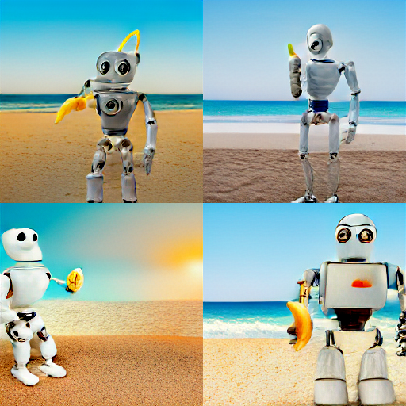
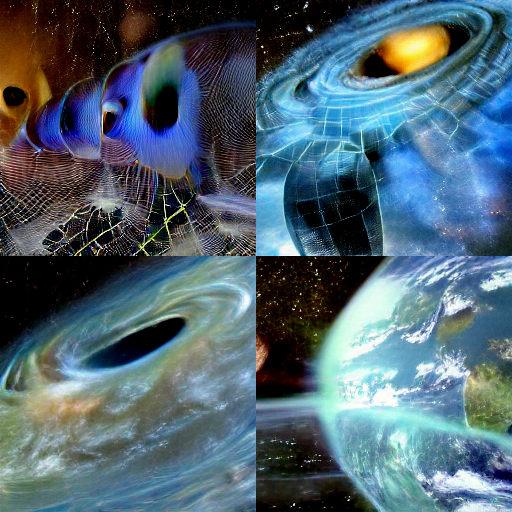
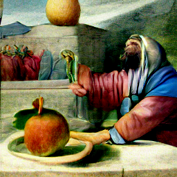
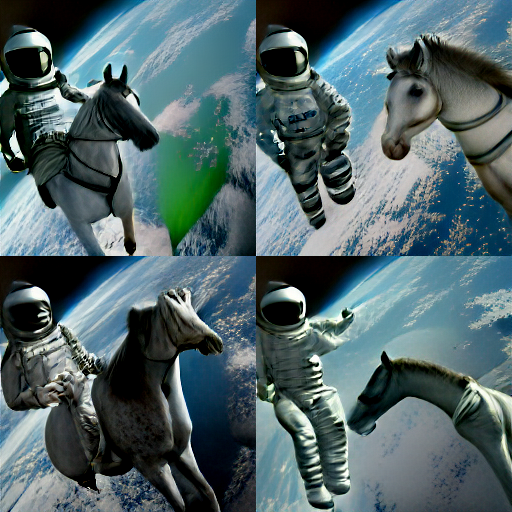

# Text-2-image
Enjoy

### TODO:
- combining with super-resolution model

# Preview
 

 

## Prerequisite
- install miniforge
- create virtual env
- pip install jupyter
- pip install min-dalle
- then pip uninstall torch (comes with min-dalle)
- pip install torch torchvision torchaudio --extra-index-url https://download.pytorch.org/whl/cu113

## Credits
- Min-Dalle (Generating Arty images)
  - https://github.com/kuprel/min-dalle
- Real-ESRGAN (Image and video restoration)
  - https://github.com/xinntao/Real-ESRGAN