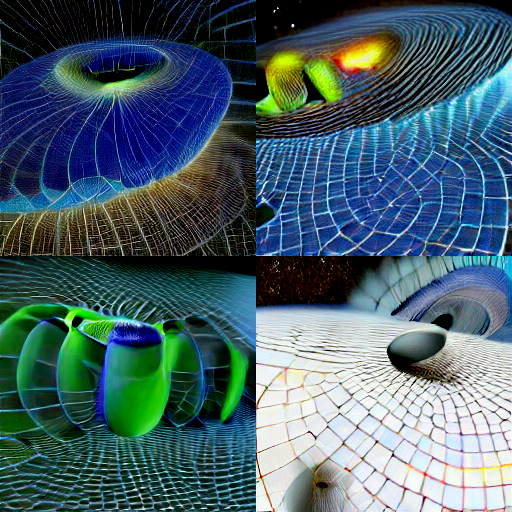

# Text-2-image
Enjoy

### TODO:
- combining with super-resolution model

# Preview
 

## Prerequisite
- install miniforge
- create virtual env
- pip install jupyter
- pip install min-dalle
- then pip uninstall torch (comes with min-dalle)
- pip install torch torchvision torchaudio --extra-index-url https://download.pytorch.org/whl/cu113
